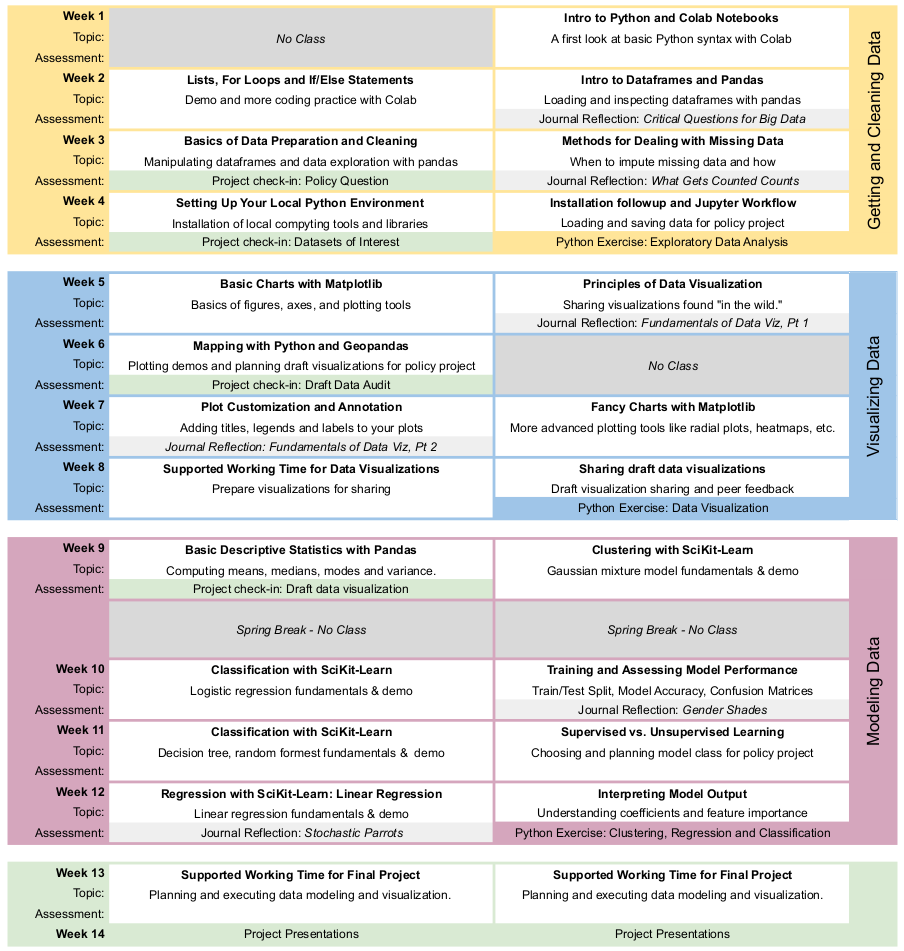
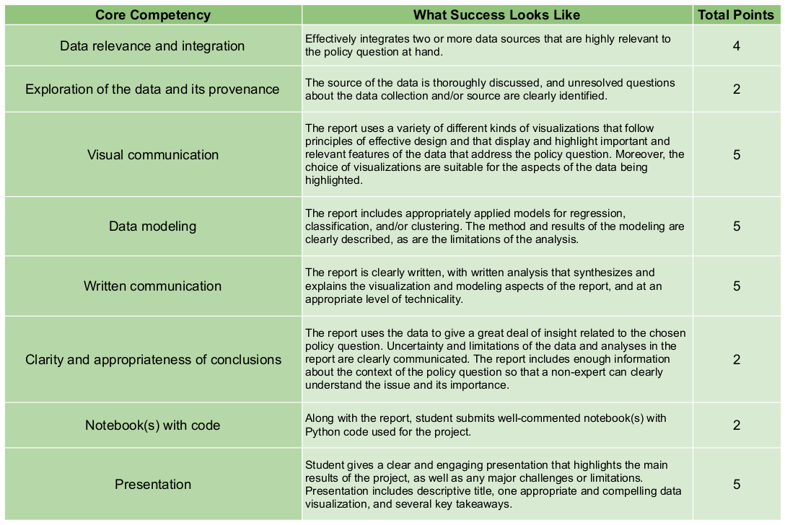

# Data Science for Global Applications

_This course material was originally prepared by [Anna Haensch](https://annahaensch.com/) and [Karin Knudson](https://karinknudson.com/) for Data Science for Global Applications taught at the Fletcher Graduate School of Global Affairs at Tufts University.  We wrote about some of our motivations and methodology for the 2022 SciPy Conference Proceedings in ["Python for Global Applications: teaching scientific Python in context to law and diplomacy students"](https://conference.scipy.org/proceedings/scipy2022/anna_haensch.html)_.

## Course Ouline

This course is designed for a 14 week semester with two 80 minute class meetings per week. Here we present the main topics and assement tools of each module.

## Weekly Planner

In what follows we provide a week-by-week plan including learning objectives, exercises, and suggested readings.

### Module I: Getting and Cleaning Data

#### Week 1

* Learning Objectives: 
  * Students will execute their first Python code in Google Colab.
  * Students will understand the difference between the Python variable types.
* In-Class Exercises: 
  * [Intro to Python Basics Notebook](https://colab.research.google.com/drive/1LOQ58TVwgSLHTadxWIcJXjtujXFJ1Ks0?usp=sharing)
* Suggested Reading: 
  * [d. boyd & K. Crawford, "Critical Questions for Big Data." (2012).](https://www.tandfonline.com/doi/full/10.1080/1369118X.2012.678878)

#### Week 2

* Learning Objectives: 
  * Students will critique the assumptions and decisions that go into data acquisition and analysis.
  * Students will load and inspect data using pandas.
  * Students will execute for loops in Python.
* In-Class Exercises: 
  * [Intro to Dataframes Notebook](https://colab.research.google.com/drive/1eWFprcL9b9UVu5bNC0AxphbViQ03wIET?usp=sharing)
* Suggested Reading:   
  * [C. D’Ignazio & L. Klein, "6. The Numbers Don’t Speak for Themselves." In Data Feminism (2020).](https://data-feminism.mitpress.mit.edu/pub/czq9dfs5)

#### Week 3
* Learning Objectives: 
  * Students will contextualize data and the absence of data within social, political, and economic contexts.
  * Students will experiment with methods to mitigate the "missingness" of data and justify decisions regaring the same.
  * Students will manipulate and explore data with Python and pandas.
* In-Class Exercises: 
  * [Intro to Exploratory Data Analysis Notebook](https://colab.research.google.com/drive/13b_kizsDNtk5_Gy2Vi-GqGgiTRkfOgls?usp=sharing)
* Suggested Reading: 
  * [C. D’Ignazio & L. Klein, “4. What Gets Counted Counts.” In Data Feminism (2020).](https://data-feminism.mitpress.mit.edu/pub/h1w0nbqp)
  * [H. Krause, "Data Biographies: Getting to Know Your Data" (2017)](https://gijn.org/2017/03/27/data-biographies-getting-to-know-your-data/)

#### Week 4
* Learning Objectives: 
  * Students will set up their local Python computing environment 
  * Students will execute command line prompts.
  * Students will transition to using Python locally in Jupyter Labs.
* In Class-Exercises:
  * [Instructions for Setting Up your Computing Environment]
* Suggested Reading: 
  * [T. Gillespie, "The Relevance of Algorithms." (2013).](https://www.microsoft.com/en-us/research/wp-content/uploads/2014/01/Gillespie_2014_The-Relevance-of-Algorithms.pdf)

### Module II: Visualizaing Data

#### Week 5
* Learning Objectives: 
  * Students will understand the fundamentals of data visualization, including the principle of proportional ink and chart junk.
  * Students will identify and discuss effective and ineffective uses of these principles in real world charts.
  * Students will have familiarity with the components of Matplotlib plots.
* In Class-Exercises: 
  * [Basics of Visualization with Matplotlib Notebook]()
* Suggested Reading: 
  * [C.O. Wilke, "Fundamentals of Data Visualization, Part I." (2019).](https://clauswilke.com/dataviz/)

#### Week 6
* Learning Objectives: 
  * Students will understand the importance of color in data visualization. 
  * Students will differentiate between qualitative and sequential color scales and identify use cases for each. 
  * Students will become familiar with mapping tools in Geopandas.
* In Class-Exercises:
  * [Mapping with Geopandas and Matplotlib Notebook]()
* Suggested Reading: 
  * [C. Weaver, "The Unmitigated Chaos of America’s Attempt at Color-Coded Covid Guidance" (2021)](https://www.nytimes.com/2021/04/02/style/coronavirus-safety-colors-states.html) 

#### Week 7
* Learning Objectives: 
  * Students will recognize the importance and impact of labels and annotation in plotting.
  * Students will identify and discuss effective and ineffective uses of annotation in real world charts.
  * Students will maniplulate labels and annotation on existing plots.
  * Students will become familiar with less common plot classes such as radial plots and heatmaps.
* In Class-Exercises:
  * [Fancy Plots with Matplolib Notebook]()
* Suggested Reading: 
  * [C.O. Wilke, "Fundamentals of Data Visualization, Part II." (2019).](https://clauswilke.com/dataviz/)

#### Week 8
* Learning Objectives: 
  * Students will demonstrate an understanding of the use cases for various plot types by selecting a plot type for their own data.
  * Students will execute a full Python visualization pipeline from ingesting the data, to printing a figure.
* Suggested Reading: 
  * [A. Cairo, "How Charts Lie, Ch. 1 & 2." (2019).](https://www.amazon.com/How-Charts-Lie-Getting-Information/dp/1324001569)

### Module III: Modeling Data

#### Week 9
* Learning Objectives: 
  * Students will compute descriptive statistics with Python and interpret the results.
  * Students will recognize the unifying structure of data models in Scikitlearn.
  * Students will perform Gaussian mixture model clustering and tune parameters on an existing model.
* In Class-Exercises:
  * [Descriptive Statistics and Gaussian Clustering Notebook]()
* Suggested Reading: 
  * [L. Breiman, "Statistical Modeling: The Two Cultures." (2021).](http://www2.math.uu.se/~thulin/mm/breiman.pdf) 

#### Week 10
* Learning Objectives: 
  * Students will split data into training and testing sets and understand the motivation for doing so.
  * Students will train a logisitic regression classifier and tune parameters on an existing model.
  * Students will assess model performance using confusion matrices and accuracy scores.
* In Class-Exercises:
  * [Logistic Regression Notebook]()
* Suggested Reading: 
  * [J. Buolamwini & T. Gebru, "Gender Shades: Intersectional Accuracy Disparities in Commercial Gender Classification." (2018).](https://proceedings.mlr.press/v81/buolamwini18a/buolamwini18a.pdf)

#### Week 11
* Learning Objectives: 
  * Students will understand the difference between supervised and unsupervised learning. 
  * Students will train decision tree and random forest classifiers and tune parameters on existing models.
  * Students will demonstrate knowledge of model classes by selecting an appropriate model class for their own dataset.
* In Class-Exercises:
  * [Decision Tree Notebook]()
* Suggested Reading: 
  * [J. Angwin, J. Larson, S. Mattu & L. Kirchner, "Machine Bias." (2016)](https://www.propublica.org/article/machine-bias-risk-assessments-in-criminal-sentencing)

#### Week 12
* Learning Objectives: 
  * Students will train a linear regression model and understand the use cases of regression models.
  * Students will analyze and interpret coefficients and feature importance across model classes.
* In Class-Exercises: 
  * [Linear Regression Notebook]()
* Suggested Reading: 
  * [E. Bender, T. Gebru, A. McMillan-Major & S. Shmitchell, "On the Dangers of Stochastic Parrots: Can Language Models Be Too Big? 🦜." (2021).](https://dl.acm.org/doi/10.1145/3442188.3445922) 

#### Week 13
* Learning Objectives: 
  * Students will execute an end-to-end machine learning pipeline using their own dataset.
  * Students will interpret model results and design compelling visualizations to communicate the same.
* Suggested Reading: 
  * [Z.C. Lipton, "The Mythos of Model Interpretability." (2017).](https://arxiv.org/pdf/1606.03490.pdf)

#### Week 14
* Learning Objectives: 
  * Students will identify key takeaways from their data exploration and modeling.
  * Students will concisely communicate their findings.

## The Policy Project 

A core throughline of this course is the policy project.  There are various checkpoints and benchmarks throughout the semester.  This project culminates with a final policy paper due at the end of the semester, as well as an in-class presentation of key findings and takeaways.  The critical checkpoints through the semester are as follows:
* __Statement of Policy Question__: Students will develop 2-3 possible policy questions to explore throughout the semester.  A brief explanation of each question will be given to give context to non-experts, and students will identify possible types of data that might be useful.  
* __Identification of Datasets of Interest__:  Students will choose one policy question of focus, and indentify 2-3 datasets that will help them answer this question.  Students will identify the steps necessary to acquire these datasets, but not necessarily carry these steps out (yet). 
* __Draft Data Audit__: Students will gain an understanding of the datasets they are using, with the goal of making sure that their data is reusable, and their work is reproducible.  This is also a mechanism for understanding the origins of the data to help uncover bias.  Precise text of the data audit assignment can he found [here](policy_project/data_audit_assignment.md).  
* __Draft Data Visualization__: Students will use the knowledge gained in the data visualization module of the course to create at least one compelling visualization of their data.  Visualizations will be accompanied by ~100 word alt-text.
* __Presentation__: Students will create a concise one-slide presentation highlighting key takeaways from the project and at leat one illustrative data visualization. Students will present this slide in conversation with the class. 
* __Policy Paper__: Students will prepare a policy paper that specifically addresses their policy question.  This paper will include a "Data Overview" section which contains a narrative version of the data audit a "Methodology" section that includes details of models used, a "Results" section that discusses model output and validation, and a "Conclusions" section that frames results in terms of the posed policy question. The rubric for the policy paper and presentation is below.

